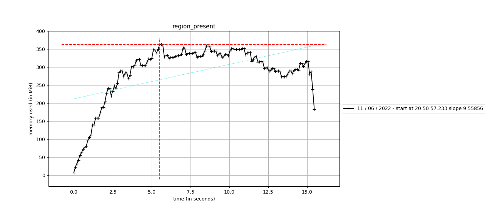

# Missing Region Memory Leak Demo

This demo shows how Botocove v1.6.1 leaks memory when the AWS region is unset by
the environment.

Execute the `chart_with_region_missing` script in this folder to reproduce the
leak.

```bash
(cd missing_region_memory_leak_demo && ./make_chart_with_region_missing)
```

The script ensures that the `AWS_DEFAULT_REGION` environment variable is unset.
It sets up a mock AWS organization containing 100 member accounts. It then uses
Botocove to instantiate a boto3 EC2 client for each account. It displays the
cove output and a chart of memory use over time recorded by Memory Profiler.

All account responses are exceptions. The exception is `NoRegionError`.

```python
{'Exceptions': [{'Arn': 'arn:aws:organizations::123456789012:account/o-y7o5kvljue/938680104769',
                 'AssumeRoleSuccess': True,
                 'Email': 'account_19@example.com',
                 'ExceptionDetails': NoRegionError('You must specify a region.'),
                 'Id': '938680104769',
                 'Name': 'account_19',
                 'RoleName': 'OrganizationAccountAccessRole',
                 'RoleSessionName': 'OrganizationAccountAccessRole',
                 'Status': 'ACTIVE'},
                ...
               ],
 'FailedAssumeRole': [],
 'Results': []}
```

Memory Profiler shows that the memory use increases with each account iteration.
The memory use peaks at around 1650MB. The trend line slope is 83.64.


Execute the `chart_with_region_present` script to compare the leaky behavior
with the normal memory use when the region is present.

```bash
(cd missing_region_memory_leak_demo && ./make_chart_with_region_present)
```

The script works the same as before except that it ensures the
`AWS_DEFAULT_REGION` environment variable is set to a valid region name.

All account responses are the "OK" result.

```python
{'Exceptions': [],
 'FailedAssumeRole': [],
 'Results': [{'Arn': 'arn:aws:organizations::123456789012:account/o-r0ecnytzug/820649851134',
              'AssumeRoleSuccess': True,
              'Email': 'account_87@example.com',
              'Id': '820649851134',
              'Name': 'account_87',
              'Result': 'OK',
              'RoleName': 'OrganizationAccountAccessRole',
              'RoleSessionName': 'OrganizationAccountAccessRole',
              'Status': 'ACTIVE'},
             ...
            ]}
```

Memory Profiler shows that the memory use remains constant over time after all
worker threads are active. The memory use peaks at around 370MB. The trend line
slope is 9.56.


